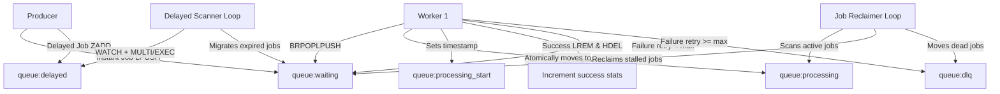

# Walkthrough: SwiftQueue Custom Queue & Dashboard

SwiftQueue has been implemented from scratch inside the workspace `/home/yogesh/Downloads/swiftqueue`. Below is a breakdown of what has been accomplished.

---

## ⚡ System Architecture

Here is the data flow showing how a Job propagates through the Redis structures and is processed reliably:



---

## 🛠️ Codebase Highlights

### 1. Root Configuration & Multi-Service Scripts
- [package.json](file:///home/yogesh/Downloads/swiftqueue/package.json): Orchestrates dependencies and runs backend, workers, and frontend concurrently during local development.

### 2. Backend Express API & WebSocket metrics broker
- [server/src/config/redis.ts](file:///home/yogesh/Downloads/swiftqueue/server/src/config/redis.ts): Set up `ioredis` with `maxRetriesPerRequest: null` (vital for blocking Redis pops).
- [server/src/queue/producer.ts](file:///home/yogesh/Downloads/swiftqueue/server/src/queue/producer.ts): Implemented the `enqueue` payload generator, atomic `zrangebyscore` delayed job scanner loop, and a **Job Reclaimer Loop** running every 5s to sweep/recover jobs stuck in `queue:processing` for over 15s.
- [server/src/routes/jobs.ts](file:///home/yogesh/Downloads/swiftqueue/server/routes/jobs.ts): REST endpoints for job generation, bulk job injection, stats polling, and DLQ replay/clear routines.
- [server/src/index.ts](file:///home/yogesh/Downloads/swiftqueue/server/src/index.ts): Integrates the REST router, a WS server polling Redis pipelines every 1000ms, and a subscriber reading logs on the `queue:events` Redis Pub/Sub channel.

### 3. Independent Workers
- [worker/src/processor.ts](file:///home/yogesh/Downloads/swiftqueue/worker/src/processor.ts): Handles mock tasks with custom simulated durations (`email`: 2s, `report`: 4s, `image`: 3s) and forces failures on jobs with `forceFail: true`.
- [worker/src/index.ts](file:///home/yogesh/Downloads/swiftqueue/worker/src/index.ts): Runs the atomic `BRPOPLPUSH` polling loop, handles worker-specific IDs, increments stats, manages retries, and publishes logs to Redis.

### 4. Premium Dashboard Frontend
- [dashboard/src/App.tsx](file:///home/yogesh/Downloads/swiftqueue/dashboard/src/App.tsx): A premium, neon dark-theme dashboard utilizing glassmorphism cards and charts (`recharts` area chart) displaying live queue metrics.
- [dashboard/src/components/StatCard.tsx](file:///home/yogesh/Downloads/swiftqueue/dashboard/src/components/StatCard.tsx): Displays counts for Active, Pending, Delayed, and DLQ jobs.
- [dashboard/src/components/TriggerActions.tsx](file:///home/yogesh/Downloads/swiftqueue/dashboard/src/components/TriggerActions.tsx): Renders custom actions (Inject 10 Instant, Inject 5 Delayed, Trigger Failure, Replay/Clear DLQ).
- [dashboard/src/components/JobLog.tsx](file:///home/yogesh/Downloads/swiftqueue/dashboard/src/components/JobLog.tsx): Telemetry logs terminal with auto-scrolling capabilities.

### 5. Docker Orchestration
- [docker-compose.yml](file:///home/yogesh/Downloads/swiftqueue/docker-compose.yml): Spins up a Redis instance, Express server, Vite React app, and a worker process.

---

## 📈 Verification Plan & Execution

All subpackages compile successfully under TypeScript:
- **Server Build**: Verified & compiled.
- **Worker Build**: Verified & compiled.
- **Dashboard Build**: Verified & compiled.

To test the application locally (if Redis/Docker is available on your machine):

1. **Docker Compose Setup**:
   ```bash
   docker compose up --build --scale worker=3
   ```
   *This starts the cluster with 3 concurrent workers. In the dashboard logs, you will observe jobs distributed evenly across workers (`[Worker #a8fb12]`, `[Worker #7d264e]`, etc.) without any duplicate executions.*

2. **Testing Reliability / Worker Crashes**:
   - Add 10 instant jobs via the dashboard.
   - Stop one of the worker processes mid-task (e.g., `docker stop <container_name>`).
   - The job currently processed by that worker remains quarantined in `queue:processing`.
   - Within 5-10 seconds, the **Job Reclaimer** on the server detects that the job has timed out (active for >15 seconds), removes it from `queue:processing`, increments its retry count, and LPUSHes it back to `queue:waiting` where another worker picks it up and successfully finishes it.
   - Verify that logs report: `[Reclaimer] Job #xyz stalled. Reclaiming & retrying (1/3)...`
